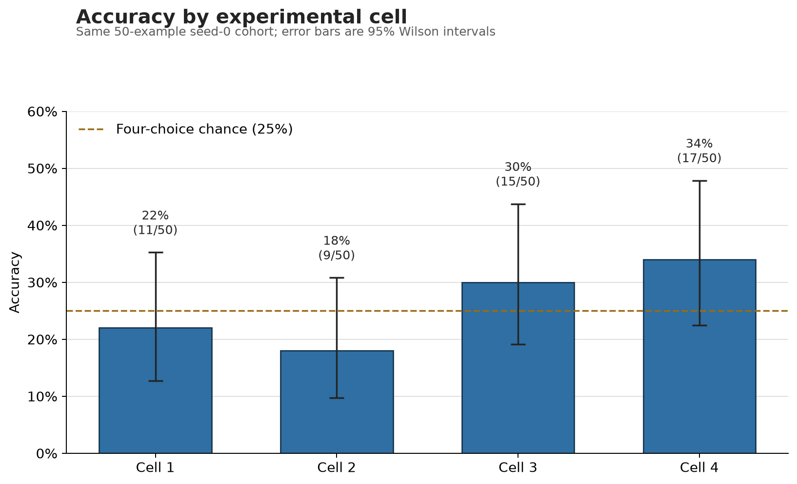
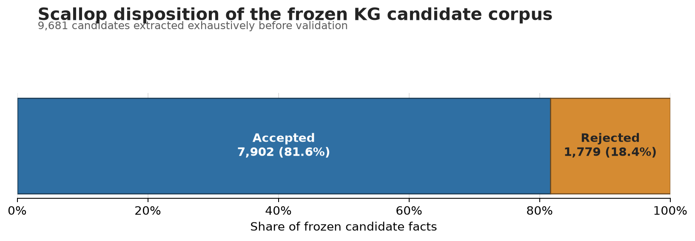

# NeuroSym Cells 1–4: exhaustive LongBench pilot

**Validation assessment: share with caveats.** All four cells completed the same ordered 50-example LongBench v2 cohort (`seed=0`) with zero runtime errors. Cell 4 had one blank parsed answer, which remains in the 50-example accuracy denominator and is scored incorrect.

## Technical summary

| Cell | Condition | Correct | Answered | Accuracy | 95% Wilson CI | Mean answer latency |
|---|---|---:|---:|---:|---:|---:|
| 1 | Flat / raw 32k-character prefix | 11/50 | 50/50 | 22% | 12.8–35.2% | 19.35 s |
| 2 | Flat / exhaustive KG, no Scallop | 9/50 | 50/50 | 18% | 9.8–30.8% | 18.07 s |
| 3 | Flat / same candidates, Scallop validated | 15/50 | 50/50 | 30% | 19.1–43.8% | 18.26 s |
| 4 | RLM / raw full source via bounded subqueries | 17/50 | 49/50 | 34% | 22.4–47.8% | 108.62 s |

Cell 4 led the observed ranking, followed by Cell 3, Cell 1, and Cell 2. The intervals are wide and overlap, so this 50-example, single-seed pilot does not establish that ranking as stable.

The dashed line is the 25% chance rate for four-choice questions. Cell 2's 9/50 result is not unusually low under that null (`P[X ≤ 9] = 0.164`). This does not establish model equivalence to random guessing; it means this sample alone cannot distinguish the observed rate from chance.

## Cleanest paired comparison: Cell 2 versus Cell 3

Cells 2 and 3 share the same ordered questions, candidate facts, flat answerer, example-scoped memory, question-only answer-time query, hybrid retrieval configuration, RRF `k=60`, and 50-triple retrieval limit. Scallop validation of the frozen candidate corpus is the intended treatment difference.

| Paired outcome | Examples |
|---|---:|
| Both correct | 8 |
| Cell 2 only correct | 1 |
| Cell 3 only correct | 7 |
| Both wrong | 34 |

The observed Scallop difference is +6/50, or +12 percentage points. The two cells produced the same answer on 38 questions and different answers on 12. The exact two-sided McNemar test over the eight discordant correctness outcomes gives `p=0.0703`: suggestive, but not conventionally significant at 0.05.

The exhaustive extraction stage produced 9,681 unique candidate facts. Scallop accepted 7,902 and rejected 1,779, retaining 81.6%.

Cell 2 retrieved 41.06 triples per question on average; Cell 3 retrieved 39.84. Both had one question with zero retrieved triples. These counts show that Scallop changed the available evidence, but the run lacks gold fact-level relevance labels, so improved retrieval precision is a plausible mechanism rather than a measured conclusion.

## Scope and metric definitions

- **Population:** 50 unique LongBench v2 examples selected with `seed=0`, in identical order in all cells.
- **Accuracy:** correct predictions divided by all 50 examples. Errors, abstentions, and blanks remain in the denominator.
- **Answered:** predictions parsed as `A`, `B`, `C`, or `D`. Cells 1–3 answered all questions; Cell 4 had one blank.
- **Uncertainty:** two-sided 95% Wilson binomial intervals. Cell 2/3 uses an exact paired McNemar test.
- **Latency:** answer-phase wall time recorded per result row. KG construction time is not included and should not be inferred from the Cell 2/3 values.

## Comparison caveats

1. **Cell 1 and Cell 4 are not evidence-normalized.** Cell 1 sees only the first 32,000 characters. Cell 4's RLM can inspect the full source through token-bounded subqueries. Their difference combines recursion with broader evidence access, so it is a system comparison, not a pure recursion ablation.
2. **Raw and KG arms do not receive equivalent evidence.** KG construction is exhaustive but question-conditioned: extraction receives the question and choices. This is held constant within the Cell 2/3 pair, but raw-versus-KG differences cannot be attributed only to representation.
3. **The sparse half of hybrid retrieval was frequently empty.** A heuristic seed extractor found no sparse seeds on 32/50 Cell 2 and Cell 3 questions. Dense retrieval still ran, and no result row was marked degraded, but “hybrid” was effectively dense-only on those examples.
4. **One example had no retrievable KG facts.** Both KG cells answered it without triples.
5. **Evidence-size columns are mode-specific.** Raw characters, rendered triple characters, and RLM-accessible source characters do not measure the same construct and should not be compared in one chart.
6. **The sample is small and uses one seed.** All four accuracy intervals overlap; the paired Cell 2/3 result needs replication.

## Reproducibility and provenance

- Model: `Qwen/Qwen3-4B`
- Server: Ynez
- Run ID: `cells123_exhaustive_ynez_20260805`
- Input SHA-256: `82b7f112eaca68f2456283745f72e495c351f85f2a37921f7a9871f73ffa4b53`
- Cell 1 and candidate-extraction code: `76f72138e065afa2c5260efbe2e18531c746e447`
- Cell 2/3 answer phase and Cell 4 code: `5c1e0dd241d537d79a743adacee2557450a6839f`
- Result hashes and cleanup evidence: [`run_metadata.json`](run_metadata.json)
- Machine-readable summary: [`summary.csv`](summary.csv)
- Paired statistics: [`paired_comparison.json`](paired_comparison.json)
- Regeneration: `python3 results/cells1_4_exhaustive_20260805/analyze_results.py`, then `python3 results/cells1_4_exhaustive_20260805/render_figures.py`. Supplying `--input /path/to/frozen/pilot_input.jsonl` additionally audits its recorded hash, IDs, and gold labels.

The later code commit changed Cell 4's subquery limits and made KG extraction exhaustive by default. Cell 2/3 answer logic was unchanged between the two recorded commits. The exact completion time could not be recovered from the copied logs, so metadata records the completion date without inventing a timestamp.

## Historical-artifact policy

This run replaces the old top-level Cell 1, Cell 2, and Cell 4 snapshots. In particular, the historical 52% Cell 2 result used pre-hybrid code and a different KG, so it must not be pooled with or compared directly to this run. Older specialized Cell 5/6 directories remain historical and are not part of this four-cell report.

## Recommended next checks

1. Replicate the paired Cell 2/3 comparison over additional seeds.
2. Test paired retrieval limits such as 10, 20, and 50 for both KG cells.
3. Persist selected fact IDs and evidence excerpts so the seven Cell 3-only successes can be audited.
4. Treat Cell 1/4 conclusions as system-level unless a future design gives both arms equivalent evidence.

The requested cleanup removed the Ynez KG mirrors and isolated run environments after the results were archived. Future KG reruns require restoring those mirrors from another archive or rebuilding them.
