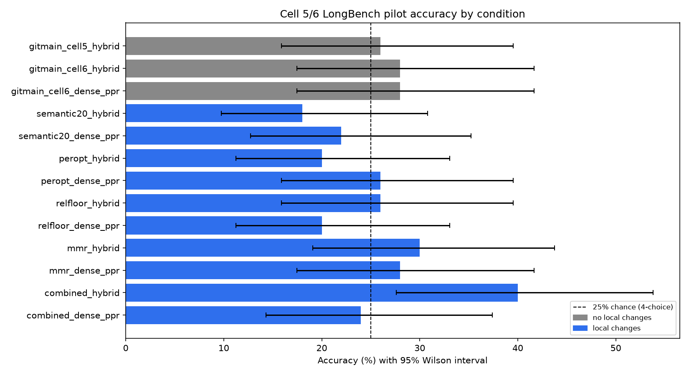

# LongBench Cell 6 KG-selection ablation: current git environment vs. local chunk-selection changes

**Validation assessment: share with caveats.** All 13 runs completed the same ordered 50-example LongBench v2 pilot cohort with zero runtime crashes at the harness level (individual examples can still terminate as `rlm_error`/token-budget/turn-limit within a run; those are scored incorrect, not excluded). This report answers two questions: (1) does the pipeline reproduce expected accuracy on the current committed git environment, and (2) do the local, uncommitted chunk-selection changes (semantic chunking + per-option query fan-out + relevance-floor filtering + MMR diversity reranking) improve on that.

## Technical summary

| Condition | KG variant | Mode | Correct | Accuracy | 95% Wilson CI | Facts in KG | Mean latency |
|---|---|---|---:|---:|---:|---:|---:|
| No local changes | gitmain (rigid, cap=3) | hybrid | 14/50 | 28% | 17.5–41.7% | 1440 | 44.5 s |
| No local changes | gitmain (rigid, cap=3) | dense_ppr | 14/50 | 28% | 17.5–41.7% | 1440 | 43.4 s |
| No local changes | gitmain (rigid, cap=3), cell 5 (no Scallop) | hybrid | 13/50 | 26% | 15.9–39.6% | 1440 | 50.8 s |
| Local changes | semantic20 (flat blended query) | hybrid | 9/50 | 18% | 9.8–30.8% | 6127 | 35.5 s |
| Local changes | semantic20 (flat blended query) | dense_ppr | 11/50 | 22% | 12.8–35.2% | 6127 | 44.8 s |
| Local changes | + per-option query fan-out | hybrid | 10/50 | 20% | 11.2–33.0% | 5677 | 40.4 s |
| Local changes | + per-option query fan-out | dense_ppr | 13/50 | 26% | 15.9–39.6% | 5677 | 34.4 s |
| Local changes | + relevance-floor (0.85) | hybrid | 13/50 | 26% | 15.9–39.6% | 5442 | 35.6 s |
| Local changes | + relevance-floor (0.85) | dense_ppr | 10/50 | 20% | 11.2–33.0% | 5442 | 43.8 s |
| Local changes | + MMR (λ=0.7) | hybrid | 15/50 | 30% | 19.1–43.8% | 5863 | 41.2 s |
| Local changes | + MMR (λ=0.7) | dense_ppr | 14/50 | 28% | 17.5–41.7% | 5863 | 34.9 s |
| Local changes | **+ all three combined** | **hybrid** | **20/50** | **40%** | **27.6–53.8%** | 5325 | 36.7 s |
| Local changes | + all three combined | dense_ppr | 12/50 | 24% | 14.3–37.4% | 5325 | 41.6 s |

`combined_hybrid` (20/50) is the best single result across every run this report or the prior session covers. All accuracy intervals overlap substantially at n=50; see the paired comparison below for a sharper read on the one pairing that matters most (no-local-changes vs. combined, same-mode).

## Paired comparison: no-local-changes vs. combined, by mode

Both arms share the same ordered 50 examples, model, and retrieval-mode config (`ppr-seed-count=40`, `branch-candidate-multiplier=5`, `max-tool-calls=3`, `--no-allow-unsupported-fallback`, `--max-depth 1`). The only intended difference is the KG-build pipeline (rigid chunking + cap=3 vs. semantic chunking + per-option/relevance-floor/MMR selection, cap=20).

| Mode | Both correct | No-local-changes only | Combined only | Both wrong | Exact McNemar p |
|---|---:|---:|---:|---:|---:|
| hybrid | 11 | 3 | 9 | 27 | 0.146 |
| dense_ppr | 8 | 6 | 4 | 32 | 0.754 |

The hybrid-mode gain (14 -> 20, 9 discordant examples favoring combined vs. 3 favoring no-local-changes) is directionally the strongest result in this whole ablation series but is **not statistically significant at n=50** (p=0.146). dense_ppr shows no meaningful difference at all (p=0.75) and numerically favors no-local-changes (14 vs. 12) -- see "dense_ppr underperforms on the combined KG" below for the mechanism, which is a real, traced finding, not sampling noise.

## dense_ppr underperforms on the combined KG: a traced mechanism, not just variance

All 7 `rlm_error` cases in `combined_dense_ppr` show the identical pattern: `invalid_ready_rejected: "cited facts do not support option X"`, following PPR graph-propagation branch expansion to 49-246 candidate facts (vs. hybrid's bounded 25-50 dense candidates, no PPR expansion). On combined's larger, diversity-optimized fact graph (MMR + relevance-floor at build time), PPR's broader propagation tends to surface topically-related-but-not-option-specific facts, triggering the adequacy gate. The controller then **re-issues the identical search query** after rejection instead of adapting it, burning its 3-call budget without ever producing a valid answer (`native tool turn limit reached without a text response`) in 7/50 examples -- accounting for most of the dense_ppr vs. hybrid gap on this KG. This suggests two separate, addressable issues: dense_ppr's branch expansion doesn't pair well with a larger/diverse fact graph, and the controller has no query-refinement step on adequacy rejection.

## Related finding (separate ablation, not in the table above): the Jul 31 extraction-bias fix

A parallel test walked back commit `a0678d8` ("Fix KG extraction bias...") to its parent (`bab533a`), which restores question-relevance-filtered extraction. That KG built only 634 facts (vs. 1440 for the same cap=3 config post-fix) and scored 9/50 on cell 6 dense_ppr, vs. 14/50 post-fix -- consistent with the fix's stated rationale. Full detail and caveats in `../gitmain_verification_2026-08-05/README.md`.

## Scope and metric definitions

- **Population:** the same ordered 50-example LongBench v2 pilot cohort in every run (deterministic split by `_id`, unchanged across this whole investigation).
- **Accuracy:** correct predictions / 50. Errors, token-budget/turn-limit fallbacks, and `EVIDENCE_INSUFFICIENT` all remain in the denominator and score incorrect.
- **Uncertainty:** two-sided 95% Wilson binomial intervals per run; exact two-sided McNemar test for the one paired comparison above.
- **KG fact count / snapshot hash:** read directly from each run's `dense_index_identity[0].fact_count` / `source_snapshot_sha256` field (see `run_metadata.json`), not recomputed separately.
- **Latency:** mean `elapsed_seconds` per result row (answer phase only; KG build time is separate and reported in the source session logs, not this table).

## Comparison caveats

1. **"No local changes" is not a single git commit.** The KG build used `origin/main` at `a0678d8`; the eval controller used the unmerged `origin/agent-set-rlm-depth-one` branch (`08f1bc8`) instead of `main` HEAD, because that branch has the intended `--max-depth 1` and main still defaults to 2 as of this run. See `../gitmain_verification_2026-08-05/README.md` for why.
2. **"Local changes" were never a single commit either.** They're the uncommitted working-tree diff active at the time these 10 local-changes runs were made (semantic chunking, per-option fan-out, relevance-floor, MMR in `chunk_selection.py`/`longbench_kg_pipeline.py`). That diff was stashed after these runs to pull unrelated upstream commits cleanly; see `run_metadata.json` for exact provenance framing.
3. **This predates Aaron's exhaustive-extraction commits** (`76f7213`..`cf067d2`, pushed Aug 5-6), which remove the chunk cap entirely. Those commits were not available when the "no local changes" and "local changes" runs here were built, so this report does not compare against exhaustive extraction. An attempted rerun against exhaustive extraction was aborted after estimating ~4.8 days wall-clock for the worst-imbalanced shard (23.6x more extraction calls than cap=3, zero concurrency support in that commit) -- see conversation history, not reproduced as a file here.
4. **The sample is small (n=50) and single-seed.** Every accuracy interval above overlaps with several others; only the one paired comparison has a real significance test, and even that is not significant.
5. **retrieval_branch_counts differ structurally by mode, not just by KG.** dense_ppr's PPR expansion (tens to hundreds of candidates) and hybrid's bounded RRF fusion (25-50) are different retrieval algorithms; the dense_ppr-underperforms finding above is about that interaction with a larger KG, not a claim that dense_ppr is categorically worse.

## Reproducibility and provenance

- Model: `Qwen/Qwen3-4B`
- Server: serrano
- No-local-changes KG build: `a0678d8` (`origin/main`); eval controller: `08f1bc8` (`origin/agent-set-rlm-depth-one`, unmerged)
- Local-changes KG build + eval: uncommitted working-tree diff (semantic chunking + chunk-selection strategies), stashed after these runs
- Per-variant KG fact counts and snapshot hashes: [`run_metadata.json`](run_metadata.json)
- Machine-readable summary: [`summary.csv`](summary.csv)
- Paired statistics: [`paired_comparison.json`](paired_comparison.json)
- Regeneration: `python3 results/longbench_cell6_selection_ablation_20260807/analyze_results.py`, then `python3 results/longbench_cell6_selection_ablation_20260807/render_figures.py`
- Raw per-example predictions: `raw/<variant>/<mode>/results.jsonl` (13 files, 50 rows each)
- Build/eval logs: `logs/`

## Historical-artifact policy

This report supersedes the standalone tables previously reported in conversation for these same 13 runs; it does not replace or duplicate `results/gitmain_verification_2026-08-05/` (which covers the no-local-changes run plus the separate Jul-31-commit walkback ablation) -- that directory remains the source for the walkback finding referenced above.

## Recommended next checks

1. Re-run the paired no-local-changes vs. combined comparison over additional seeds/example sets to see if the hybrid-mode p=0.146 firms up with more data.
2. Fix the controller's no-query-refinement-on-rejection gap, then re-test dense_ppr on the combined KG specifically -- the traced mechanism above suggests this alone could close most of the dense_ppr/hybrid split.
3. Test the combined chunk-selection strategies (per-option + relevance-floor + MMR) layered on top of Aaron's exhaustive extraction, with concurrency reintroduced -- neither has been tested together yet.
4. If pursuing exhaustive extraction further, rebalance shards by chunk-count (not doc-count) and reintroduce `extraction_concurrency`/`verify_concurrency` before attempting a full-cohort build.
